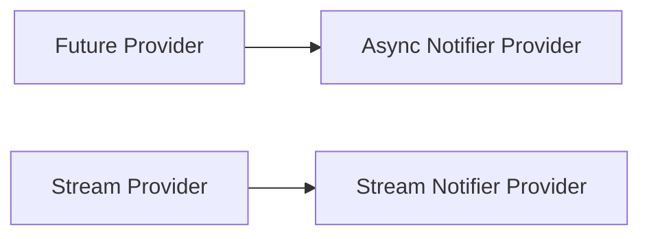

## Freezed Package
### Basic Setup
```shell
freezed_annotation
dev: freezed

json_annotation
dev:json_serializable

dev:build_runner
```
To avoid lint warning while generating files modify `analysis_options.yaml`
```yaml
analyzer:
  errors:
    invalid_annotation_target: ignore
  exclude:
	- '**/*.freezed.dart'
	- '**/*.g.dart'
```
To run code generator run
`dart run build_runner watch [-d]`

Install VS Code Freezed extention and type to generate:
1. `ptf`: part freezed file: 
2. `pts`: part file
3. `fdataclass`: freezed class
4. `funion`: freezed union class

### Basic Setup

`analysis_options.yaml`
```yaml
linter:
  rules:
    prefer_const_constructors: true

analyzer:
  plugins:
    - custom_lint
  exclude:
    - "**/*.g.dart"
```
### Examples
**Person immutable class**
1️⃣ All are immutable.
```dart
import 'package:freezed_annotation/freezed_annotation.dart';
import 'package:flutter/foundation.dart';
part 'person.freezed.dart';
@freezed
abstract class Person with _$Person {
  const factory Person({
    required int id,
    required String name,
    required String email,
  }) = _Person;
}
```
**Person mutable class**
1️⃣ For mutable class freezed doesn't override the equality operator.
```dart
@unfreezed
abstract class MutablePerson with _$MutablePerson {
  factory MutablePerson({
    required final int id, // we cannot change id (immutable)
    required String name,
    required String email,
  }) = _MutablePerson;
}
```
**Making list modifiable:**
```dart
@freezed
abstract class Students with _$Students {
  factory Students(List<int> list) = _Students;
}

@Freezed(makeCollectionsUnmodifiable: false)
abstract class StudentNew with _$StudentNew {
  factory StudentNew(List<int> list) = _StudentNew;
}
```
UI
```dart
    final std1 = Students([]);
    std1.list.add(
      45,
    ); // Unsupported operation: Cannot add to an unmodifiable list

    final std2 = StudentNew([]);
    std2.list.add(45); // Works fine
```
**Custom method declaration**

1️⃣ Private empty constructor `const Method._()` need to define whenever we need some custom methods. like. `printMethod()`.
```dart
@freezed
abstract class Method with _$Method {
  const Method._();

  factory Method(String methodName, {double? version}) = _Method;

  printMethod() {
    print('$methodName $version');
  }
}
```
### Complex class example
1️⃣ Class uses `freezed` and `json_serializable` with annotation for both.

Hotel Class
```dart
import 'package:freezed_annotation/freezed_annotation.dart';

part 'hotel.g.dart';
part 'hotel.freezed.dart';

@freezed
abstract class Hotel with _$Hotel {
  @JsonSerializable(
    explicitToJson: true,
  ) // explicitToJson, json serializable will call to nested objects as well.
  const factory Hotel({
    required String name,
    required int classification,
    required String city,
    @JsonKey(name: 'parking_lot_capacity') int? parkingLotCapacity,
    @Default([]) List<Review> reviews,
  }) = _Hotel;

  factory Hotel.fromJson(Map<String, dynamic> json) => _$HotelFromJson(json);
}

@freezed
abstract class Review with _$Review {
  const factory Review({required double score, String? review}) = _Review;
  factory Review.fromJson(Map<String, dynamic> json) => _$ReviewFromJson(json);
}
```
Hotel Repository
```dart
import 'dart:convert';

import 'package:riverpod_basics/apps/freezed/models/hotel.dart';

const String jsonData = '''
[
  {
    "name":"ABC",
    "classification":5,
    "city":"New York",
    "parking_lot_capacity":500,
    "reviews":[
      {
        "score":4.5,
        "review":"Excellent"
      },
      {
        "score":5.0,
        "review":"Very friendly staff, excellent service!"
      }
    ]
  },
  {
    "name":"DEF",
    "classification":5,
    "city":"Boston",
    "reviews":[
      {
        "score":4.0,
        "review":"Very good"
      },
      {
        "score":5.0
      }
    ]
  },
  {
    "name":"GHI",
    "classification":5,
    "city":"LA"
  },
  {
    "name":"JKL",
    "classification":5,
    "city":"Chicago",
    "parking_lot_capacity":250,
    "reviews":[
      {
        "score":5,
        "review":"Recommended"
      },
      {
        "score":5.0,
        "review":"Soooo goooood"
      }
    ]
  }
]
''';

Future<List<Hotel>> fetchHotels() async {
  await Future.delayed(const Duration(seconds: 1));
  final List hotelList = jsonDecode(jsonData);

  final hotels = [for (final hotel in hotelList) Hotel.fromJson(hotel)];

  return hotels;
}
```

## Riverpod

### Basic Commands
`dart run build_runner watch  -d`
`dart run build_runner build -d`

### Required Packages

```dart
flutter pub add flutter_riverpod
flutter pub add riverpod_annotation
flutter pub add dev:riverpod_generator
flutter pub add dev:build_runner
flutter pub add dev:custom_lint
flutter pub add dev:riverpod_lint
```

## Chapter-I: All Providers

### Types of Providers 

1. Provider - read only provider
2. State Provider - for managing simple state
3. Future Provider
4. Stream Provider
5. State Notifier Provider
6. Change Notifier Provider (Not Recommended)
7. Notifier Provider ⭐️
8. Async Notifier Provider ⭐️
9. Stream Notifier Provider



✅ Future Provider is used to handle simple async operations where no user interaction required.
✅ The Async Notifier Provider used to handle complex cases with user interaction.


### Provider modifiers
1. none
2. autoDispose
3. family

### Type of Widget to wrap
1. Consumer: Wrap the widget with consumer widget to listen to changes.
2. ConsumerWidget:

### Ref
1. **watch**: Listen for the changes and re-build the UI.
2. **listen**: Listen for the changes in the values, it does not re-build the UI, but performs actions. Like displaying dialog or navigating to the pages.
3. **read**: Ignores the changes. Useful for button callback.

## 1. Basic Provider 

### Simple Providers

**STEP-01**: Wrap with Provider Scope
`main.dart`
```dart
void main() {
  runApp(const ProviderScope(child: MyApp()));
}
 ```

**STEP-02**: Create a basic provider
`basic_provider.dart`
```dart
final helloProvider = Provider<String>((ref) {
  return 'Hello';
});
 ```
 
**STEP-03**: Access or listen to the provided value, via **Consumer**
`basic_provider.dart`
```dart
	Consumer(
          // child -> specifies the widget which we dont want to rebuild
          builder: (context, ref, child) {
            final hello = ref.watch(helloProvider);
             return Text(hello);
          },
        ),
 ```
**STEP-03 (a)**: Access or listen to the provided value, via **ConsumerWidget**
`basic_provider.dart`
```dart
class BasicPage extends ConsumerWidget {
...
  @override
  Widget build(BuildContext context, WidgetRef ref) {
    final hello = ref.watch(helloProvider);
    return Scaffold(
      body: Center(child: Text(hello)),
    );
  }
}
 ```

### Auto Disposed
The provider will be auto disposed.
```dart
final helloAutoDisposeProvider = Provider.autoDispose<String>((ref) {
  ref.onDispose(() {
    print("helloProvider disposed");
  });
  return 'Hello';
});
```

### Family
Used to pass additional parameter from outside.
```dart
final helloFamilyProvider = Provider.family<String, String>((ref, name) {
  return 'Hello $name';
});
```

### Riverpod Code Generation
```dart
import 'package:flutter_riverpod/flutter_riverpod.dart';
import 'package:riverpod_annotation/riverpod_annotation.dart';

part 'basic_provider.g.dart';

// keepAlive:true - autoDispose is off
@Riverpod(keepAlive: true)
String hello(Ref ref) {
  return "hello";
}

@riverpod
String familyHello(Ref ref, {required String name}) {
  return 'Hello, $name';
}
```
**Generate code**
One time code generate
`dart run build_runner build -d`
Watch for code changes
`dart run build_runner watch  -d`

## 2. State Provider
### Counter Example

`basic_provider.dart`
```dart
final counterProvider = StateProvider<int>((ref) {
  return 0;
});
```
`Widget`
```dart
Widget build(BuildContext context, WidgetRef ref) {
    final count = ref.watch(counterProvider);
    // add a listener to display dialog when the count becomes 3.
    ref.listen(counterProvider, (prev, next) {
      if (next == 3) {
        showDialog(
          context: context,
          builder: (context) =>
              const AlertDialog(content: Text("Count reaches to 3")),
        );
      }
    });
    return Scaffold(
      body: Center(child: Text(count.toString())),
      floatingActionButton: FloatingActionButton(
        onPressed: () {
          ref.read(counterProvider.notifier).state++;
          // OR (Equivalent)
          ref.read(counterProvider.notifier).update((state) =>  state  +  10);
        },
        child: const Icon(Icons.add),
      ),
    );
  }
```

## 3. Future Provider
✅ Future provider is used to solve simple cases like fetching data from network.
✅ Future provider can not be used for directly modifying the state by user interaction.
✅ Future provider can perform refresh and reload to the page when error occurs. But for good practice use AsyncNotifierProvider.

### Example - Simple Data Fetching App
Provider for Dio
```dart
@riverpod
Dio dio(Ref ref) {
  return Dio(BaseOptions(baseUrl: 'https://dummyjson.com'));
}
```
User Provider
```dart
@riverpod
Future<List<UserModel>> userList(Ref ref) async {
  final response = await ref.watch(dioProvider).get('/users');
  final userList = response.data['users'];
  final users = [for (final user in userList) UserModel.fromMap(user)];
  return users;
}

@riverpod
Future<UserModel> userDetail(Ref ref, String id) async {
  final response = await ref.watch(dioProvider).get('/users/$id');
  final user = UserModel.fromMap(response.data);
  return user;
}
```
UI
```dart
final  userData  =  ref.watch(userDetailProvider(id));
...
	userData.when(
        data: (user) {},
        error: (err, st) => Text(err.toString()),
        loading: () => const Center(child: CircularProgressIndicator()),
      ),
  ```

### Data Caching
1. `ref.keepAlive` is used for caching.
2. if there is not internet, then cached version of user details will be seen.
3. KeepAlive can be used only if the provider is AutoDispose Provider.
4. Always KeepAlive method after network call.

```dart
@riverpod
Future<UserModel> userDetail(Ref ref, String id) async {
  ref.onDispose(() {
    print("userDetailProvider dispose");
  });
  final response = await ref.watch(dioProvider).get('/users/$id');
  ref.keepAlive();
  final user = UserModel.fromMap(response.data);
  return user;
}
```
### Reload or Refresh Page
```dart
RefreshIndicator(
  onRefresh: () async => ref.invalidate(userListProvider),
)
```

## 4. Stream Provider
✅ A sequence of asynchronous data.
✅ Manually created providers are KeepAlice by default.
✅ Generators created providers are auto dispose by default.

### Simple Ticker
Provider
```dart
// --------- MANUAL ---------
final tickerProvider = StreamProvider<int>((ref) {
  ref.onDispose(() {
    print("tickerProvider disposed");
  });
  return Stream.periodic(const Duration(seconds: 1), (t) => t + 1).take(60);
});

// --------- GENERATOR ---------
@riverpod
Stream<int> ticker(Ref ref) {
  ref.onDispose(() {
    print("tickerProvider disposed");
  });
  return Stream.periodic(const Duration(seconds: 1), (t) => t + 1).take(60);
}
```
UI
```dart
ticker.when(
          data: (d) => Text(d.toString()),
          error: (err, st) => Text(err.toString()),
          loading: () => const CircularProgressIndicator(),
        ),
```

## 5. State Notifier Provider
✅ Handles complex business logic.
✅ The state provided by StateNotifierProvider can only be changed through the interface **ChangeNotifierProvider** and **ChangeNotifier**

### Todo Example
State
```dart
// provider
final todoProvider = StateNotifierProvider<TodoState, List<TodoModel>>((ref) {
  return TodoState();
});

class TodoState extends StateNotifier<List<TodoModel>> {
  TodoState() : super([]);

  void addTodo(String desc) {
    state = [...state, TodoModel.add(desc: desc)];
  }

  void toggleTodo(String id) {
    state = [
      for (final todo in state)
        if (todo.id == id)
          todo.copyWith(isCompleted: !todo.isCompleted)
        else
          todo,
    ];
  }

  void removeTodo(String id) {
    state = [
      for (final todo in state)
        if (todo.id != id) todo,
    ];
  }
}
```
## 6. Change Notifier Provider (Not Recommended)

## 7. Notifier Provider ⭐️
✅ Recommended.
✅ Handles complex business logic.

### Example - Counter App - Without Generators
Provider
```dart
// here we initialize the int to -> 0 synchronously.
// if we want async initialization then use AsyncNotifier.

// provider
// here we do not need to pass ref, bez its already there.
// final counterStateProvider = NotifierProvider<CounterState, int>(() {
//   return CounterState();
// });

// constructor tear-off
final counterStateProvider = NotifierProvider<CounterState, int>(
  CounterState.new,
);

// AutoDisposeNotifier to unable auto-dispose
class CounterState extends Notifier<int> {
  @override
  int build() {
    ref.onDispose(() {
      print("CounterState disposed");
    });

    return 0;
  }

  void increment() {
    state++;
  }
}
```
Provider with family
```dart
// constructor tear-off
final counterStateProvider = NotifierProvider.family<CounterState, int, int>(
  CounterState.new,
);

// AutoDisposeNotifier to unable auto-dispose
class CounterState extends FamilyNotifier<int, int> {
  @override
  int build(int initialValue) {
    ref.onDispose(() {
      print("CounterState disposed");
    });

    return initialValue;
  }

  void increment() {
    state++;
  }
}
```

### Example - Counter App - With Generators
Provider
```dart
part 'counter_provider.g.dart';

@riverpod
class CounterState extends _$CounterState {
  @override
  int build(int initialValue) {
    ref.onDispose(() {
      print("CounterState disposed");
    });

    return initialValue;
  }

  void increment() {
    state++;
  }
}
```

## 8. Async Notifier Provider ⭐️

✅ Recommended.
✅ Handles complex business logic.

### Example Async Counter without Generators with Retry Button
Counter
```dart
// provider
final counterProvider = AsyncNotifierProvider<Counter, int>(() {
  return Counter();
});

class Counter extends AsyncNotifier<int> {
  @override
  FutureOr<int> build() async {
    ref.onDispose(() {
      print("CounterState Disposed");
    });

    await waitSecond(); // to simulate network call
    return 0;
  }

  Future<void> waitSecond() => Future.delayed(const Duration(seconds: 1));

  Future<void> increment() async {
    state = const AsyncLoading();
    try {
      await waitSecond(); // api call
      state = AsyncData(state.value! + 1); // state.value gives the prev state.
    } catch (error, stackTrace) {
      state = AsyncError(error, stackTrace);
    }
  }
}
```
UI - With retry button
```dart
Widget build(BuildContext context, WidgetRef ref) {
    final counter = ref.watch(counterProvider);
    print(counter);

    return Scaffold(
      appBar: AppBar(title: const Text("Counter App")),
      body: Center(
        child: counter.when(
          data: (counter) {
            return Column(
              children: [
                Text(counter.toString()),
                MaterialButton(
                  onPressed: () =>
                      ref.read(counterProvider.notifier).increment(),
                  child: const Text("Increment"),
                ),
              ],
            );
          },
          error: (error, stackTrace) {
            return Column(
              children: [
                Text(error.toString()),
                MaterialButton(
                  onPressed: () => ref.invalidate(counterProvider),
                  child: const Text("Retry"),
                ),
              ],
            );
          },
          loading: () => const CircularProgressIndicator(),
        ),
      ),
    );
  }
```
### Async Guard 
When writing your own  `AsyncNotifier`  subclasses, it's quite common to use try/catch blocks to deal with Futures that can fail. In such cases,  `AsyncValue.guard`  is a convenient alternative that does all the heavy-lifting for us without try and catch block.
```dart
Future<void> increment() async {
    state = const AsyncLoading();
    state = await AsyncValue.guard(() async {
      await waitSecond(); // api call
      return state.value! + 1;
    });
  }
```

### Counter Example with Generators and Async Guard
Counter
```dart
@riverpod
class Counter extends _$Counter {
  @override
  FutureOr<int> build() async {
    ref.onDispose(() {
      print("CounterState Disposed");
    });

    await waitSecond(); // to simulate network call
    return 0;
  }

  Future<void> waitSecond() => Future.delayed(const Duration(seconds: 1));

  Future<void> increment() async {
    state = const AsyncLoading();
    state = await AsyncValue.guard(() async {
      await waitSecond(); // api call
      return state.value! + 1;
    });
  }
}
```
### Async Example - Fetching API Data
Activity Model
```dart
class ActivityModel {
  final String activity;
  final String accessibility;
  final String type;
  final int participants;
  final double price;
  final String key;
}
final  activityTypes  = ["education",  "social",  "diy",  "cooking",  "music"];
```
Dio Provider
```dart
@riverpod
Dio dio(Ref ref) {
  return Dio(BaseOptions(baseUrl: 'https://bored-api.appbrewery.com'));
}
```
State
```dart
part 'async_activity.g.dart';

@riverpod
class AsyncActivity extends _$AsyncActivity {
  @override
  FutureOr<ActivityModel> build() {
    return getActivity(activityTypes[0]);
  }

  Future<ActivityModel> getActivity(String activityType) async {
    final response = await ref
        .read(dioProvider)
        .get('/filter?type=$activityType');
    return ActivityModel.fromMap(response.data[0]);
  }

  Future<void> fetchActivity(String activityType) async {
    state = const AsyncValue.loading();
    state = await AsyncValue.guard(() async {
      return getActivity(activityType);
    });
  }
}
```
**If we want to show dialog when error occurs and skip the error shown by the AsyncValue.Error we can use below code**
```dart
Widget build(BuildContext context, WidgetRef ref) {
    // Throw error when there is an error
    ref.listen<AsyncValue<ActivityModel>>(asyncActivityProvider, (prev, next) {
      if (next.hasError && !next.isLoading) {
        showDialog(
          context: context,
          builder: (context) =>
              AlertDialog(content: Text(next.error.toString())),
        );
      }
    });
   ...
   ...
   activityState.when(
        skipError: true,
        error: (error,  st) =>  const  Text("Get some data"), 
        // only initial error gets printed.
   ...
   ...
 }
```

## 9. Stream Notifier Provider - 54, 55

## Chapter-II: Async Value Details

### Weather App
Weather app with retry fetch and dialog box shown when error.
Provider
```dart
part 'weather_first_provider.g.dart';

@riverpod
class WeatherFirst extends _$WeatherFirst {
  @override
  FutureOr<String> build() {
    return _getTemp(Cities.seoul);
  }

  Future<String> _getTemp(Cities city) async {
    await Future.delayed(const Duration(seconds: 1));
    switch (city) {
      case Cities.seoul:
        return '${city.name} - 🌡️ 23℃';
      case Cities.london:
        throw 'Failed to fetch the temperature of ${city.name}';
      case Cities.bangkok:
        throw 'Failed to fetch the temperature of ${city.name}';
      case Cities.tokyo:
        return '${city.name} - 🌡️ 28℃';
    }
  }

  Future<void> getTemperature(Cities city) async {
    state = const AsyncLoading();
    state = await AsyncValue.guard(() => _getTemp(city));
  }
}
```
UI
```dart
int _selectedCityIndex = 1;

class WeatherFirstPage extends ConsumerWidget {
  const WeatherFirstPage({super.key});

  @override
  Widget build(BuildContext context, WidgetRef ref) {
    ref.listen<AsyncValue<String>>(weatherFirstProvider, (prev, next) {
      if (next.hasError && !next.isLoading) {
        showDialog(
          context: context,
          builder: (context) {
            return AlertDialog(content: Text(next.error.toString()));
          },
        );
      }
    });
    return Scaffold(
      appBar: AppBar(title: const Text("Weather First Page")),
      body: weather.when(
        data: (temp) {
          return Column(children: [Text(temp), const GetWeatherButton()]);
        },
        error: (err, st) {
          return Column(
            children: [
              Text(err.toString(), style: const TextStyle(color: Colors.red)),
              const GetWeatherButton(),
            ],
          );
        },
        loading: () => const Center(child: CircularProgressIndicator()),
      ),
    );
  }
}

class GetWeatherButton extends ConsumerWidget {
  const GetWeatherButton({super.key});

  @override
  Widget build(BuildContext context, WidgetRef ref) {
    return TextButton(
      onPressed: () {
        final cityIndex = _selectedCityIndex % 4;
        final city = Cities.values[cityIndex];
        _selectedCityIndex++;
        ref.read(weatherFirstProvider.notifier).getTemperature(city);
      },
      child: const Text("Get Weather"),
    );
  }
}
```
## Chapter-III: Provider Life Cycle

### Example
1️⃣ Cancelling of network request when user presses back button. (Dio feature)
2️⃣ Caching of the product data.
3️⃣ Future family provider.

```dart
// basic provider
@riverpod
Dio dio(Ref ref) {
  return Dio(BaseOptions(baseUrl: 'https://dummyjson.com'));
}

@riverpod
FutureOr<List<Product>> getProducts(Ref ref) async {
  final cancelToken = CancelToken(); // from dio package 1️⃣
  ref.onDispose(() {
    print("[getProductsProvider] disposed & cancelled");
    cancelToken.cancel();
  });
  
  final response = await ref
      .watch(dioProvider)
      .get('/products?limit=15', cancelToken: cancelToken);
  final List productList = response.data['products'];

  ref.keepAlive(); // response from web is cached 2️⃣
  final products = [
    for (final product in productList) Product.fromJson(product),
  ];
  return products;
}

// family provider 3️⃣
@riverpod
FutureOr<Product> getProduct(Ref ref, {required int productId}) async {
  final response = await ref.watch(dioProvider).get('/products/$productId');
  final product = Product.fromJson(response.data);
  return product;
}
```
### Example, Customised Cache
1️⃣ Cache: saves the result for 10 sec using timer.

```dart
@riverpod
FutureOr<List<Product>> getProducts(Ref ref) async {
  // from dio package
  final cancelToken = CancelToken();
  Timer? timer;

  ref.onDispose(() {
    cancelToken.cancel();
    timer?.cancel();
  });

  ref.onResume(() {
    timer?.cancel();
  });

final response = await ref
      .watch(dioProvider)
      .get('/products?limit=15', cancelToken: cancelToken);
final List productList = response.data['products'];
final keepAliveLink = ref.keepAlive(); // response from web is cached

ref.onCancel(() {
    print("OnCancel, timer started");
    timer = Timer(const Duration(seconds: 10), () {
      keepAliveLink.close();
    });
  });

...........
}
```
## Chapter-IV: Scopes

### Scopes - Usages
✅ **Widget Rebuild Optimisation**: 
Do not use the widget constructors, instead pass through the provider. In this way the widget will not build again and again. Always make a widget const.
Do this when fetching huge amount of data.

**PROBLEM**
When we iterate through the fetch API data like below pseudocode,
```dart
ListView{
	...
	...
	child: ListTileWidget(data)
}

Widget ListTileWidget(data){
	data...
	....
}
```
Here the `ListTileWidget` will load again and again. Means whenever there will be a new item added, it will rebuild all the existing data as well. Also when we delete any one item from the list, the whole UI rebuilds again to render all the items.

**SOLUTION**
Only the newly added items are redrawn.
**STEP 01: Provider** 
```dart
// does not depends on any providers
@Riverpod(dependencies: [])
String currentItem(Ref ref) {
  throw UnimplementedError();
}
```
**STEP 02:**
Wrap the item which calls the looping Widget through a ProviderScope,
```dart
return ProviderScope(
	  overrides: [currentItemProvider.overrideWithValue(items[index])],
	  child: const MyCustomWidget(),
	);
},

// This widget has become now constant widget.
// Now, no rebuilding when new items inserted.
class MyCustomWidget extends ConsumerWidget {
  const MyTile({super.key});
  @override
  Widget build(BuildContext context, WidgetRef ref) {
    final item = ref.watch(currentItemProvider);
    return ListTile(title: Text(item));
  }
}
```
### Initialisation of Synchronous Provider for Async APIs
We will be using shared preferences to store the results and fetch whenever we need.

SharedPreferences Provider
```dart
// We will not handle the Async creation of shared preferences.
// Bez. we rarely get error while creating.
@riverpod
SharedPreferences sharedPreferences(Ref ref) {
  throw UnimplementedError();
}
```
Main
```dart
void main() async {
  WidgetsFlutterBinding.ensureInitialized();
  // create shared preferences instance
  final prefs = await SharedPreferences.getInstance();

  runApp(
    ProviderScope(
      // List the providers, whose value we want to replace
      // We are replacing sharedPreferencesProvider 
      // with UnimplementedError to SharedPreferences instance.
      overrides: [sharedPreferencesProvider.overrideWithValue(prefs)],
      child: const MyApp(),
    ),
  );
}
```
Counter State
```dart
@riverpod
class CounterState extends _$CounterState {
  @override
  int build() {
    final prefs = ref.watch(sharedPreferencesProvider);
    final currentValue = prefs.getInt('counter') ?? 0;

    // when we want to listen the changes of provider itself we can use,
    listenSelf((prev, next) {
      print("Prev: $prev, Next: $next");
      prefs.setInt('counter', next);
    });
    return currentValue;
  }

  void increment() {
    state++;
  }
}
```
Reading the Pref. value
```dart
	Consumer(
          builder: (context, ref, child) {
            final prefs = ref.watch(sharedPreferencesProvider);
            final val = prefs.getInt('counter');

            return Text('$val');
          },
        ),
```
<mark>Incomplete Section-7, 77 to 82. </mark>

## Chapter-V: Miscellaneous

### Observing all Providers
Using ProviderObserver we can easily track each provider.

✅ We can track when the provider is initialised and disposed.
✅ How the state is behaving.

ProviderScope
```dart
ProviderScope(
      observers: [Logger()],
      child: const MyApp(),
    ),
```
Logger Class
```dart
class Logger extends ProviderObserver {
  @override
  void didAddProvider(...) {
    print('''
      provider: ${provider.name} ?? ${provider.runtimeType} 
      is initialized with value $value
    ''');
  }

  @override
  void didDisposeProvider(...) {
    print('''
      provider: ${provider.name} ?? ${provider.runtimeType} is disposed
    ''');
  }

  @override
  void didUpdateProvider(...) {
    print('''
      provider: ${provider.name} ?? ${provider.runtimeType} is updated 
      with old value:  $previousValue and updated value: $newValue
    ''');
  }
}
```
